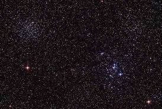
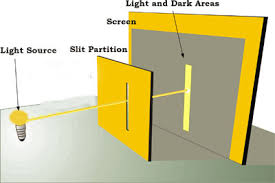
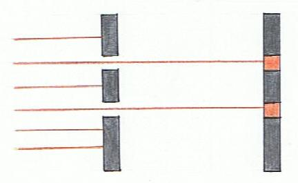
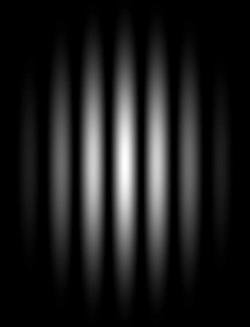
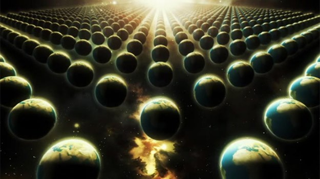
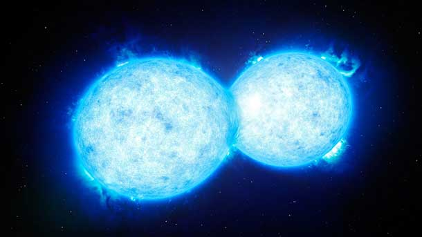
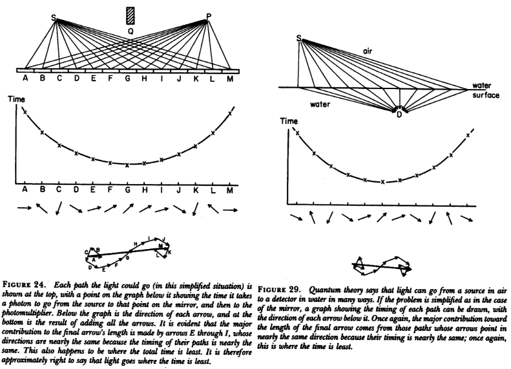
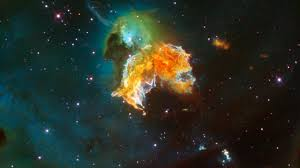
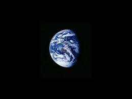

^ let's consider the universe. It's made up of particles. Like atoms, and things that make up atoms...

^ Physicists have observed *weird* things about particles, particularily light particles

---

---

---

^ Something is interfering with the light. Is it the same particle? This means that each particle passes through both slits at the same time and interferes with itself. but how. 

^ but what do you get if you observe the particles passing thru one slit? this result changes if you observe the particle.

---

^ video of the particles flying thru slits with eyeball watching (https://youtu.be/DfPeprQ7oGc?t=228)

---

>  "a phenomenon which is impossible […] to explain in any classical way, and which has in it the heart of quantum mechanics. In reality, it contains the only mystery [of quantum mechanics]."

- Richard Feynman

---

David Deutsch posits that this phenomenon is evidence of a multiverse
&
the interference the particle encounters is the path that it took in a different universe.

^ by observing the particle, we are placing ourselves firmly in the universe where the particle took a single path, instead of any path

---

^ Deutsch's theory says that the laws of physics are the same in every version, the only thing that differs is the acutal distribution of particles

---

^ a new 'universe' is created every time a choice has to be made.

---

^ consider a stack of cards. what's the probability that i'll pick out the A of hearts?

^ one in 52. so in 51 versions of the universe, i pick a card that is not the ace of hearts. but in one version of the universe, i pick the ace of hearts.

---

^ this maps nicely to what feynman discovered about light -- how the probability of its spin distribution maps to where it ends up 

---

^ taking this implication out further, the heat death of the universe will occur when every possible configuration of particles has been explored

---

^ this means that every possible version of you exists.

^ and that there are universes where you fail to exist

---

^ There are versions of the universe where Donald Trump never ran for President.

---

^ Since every possible version that is physically possible exists or will exist, which universe you live in is up to you. And that's why the theory of the multiverse is strong proof of free will.

